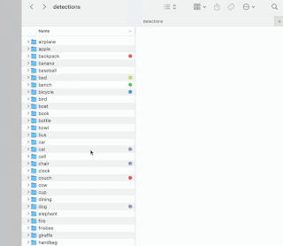

# Paw Patrol

## Overview

Paw Patrol is a command-line tool that finds cats, dogs, and other objects in Google Street View images using machine learning object detection (COCO-SSD model based on TensorFlow.js).



## Features

- Search for objects in Google Street View based on coordinates or address
- Generate random coordinates within a radius to scan an area
- Detect multiple object classes (people, cars, cats, dogs, etc.)
- Cache Street View images to avoid redundant API calls
- Save and highlight detected objects in output images
- Filter results by object type

## Prerequisites

- Node.js (v14 or later recommended)
- Google Maps API key with Street View and Geocoding APIs enabled

## Installation

1. Clone the repository:

```bash
git clone https://github.com/yourusername/paw-patrol.git
cd paw-patrol
```

2. Install dependencies:

```bash
npm install
```

## Usage

Run the application:

```bash
npm start
```

Or directly with Node:

```bash
node src/index.js
```

The interactive CLI will guide you through the process:

1. Enter your Google Maps API key (if not already configured)
2. Choose between searching by address or coordinates
3. Set search parameters (radius, number of points, etc.)
4. Select detection confidence threshold
5. Choose which objects to highlight in the results

## Configuration

The application stores your API key and preferences in a `.config.json` file for future use.

## Project Structure

- `src/index.js` - Main application code
- `cache/` - Directory for caching Street View images
- `output/` - Directory for saving processed images with detected objects

## Dependencies

- axios - HTTP client for API requests
- fs-extra - Enhanced file system operations
- sharp - Image processing
- @tensorflow/tfjs-node - TensorFlow.js for Node.js
- @tensorflow-models/coco-ssd - COCO-SSD object detection model
- @inquirer/prompts - Interactive command line interface

## License

This project is licensed under the MIT License - see the [LICENSE](LICENSE) file for details.
